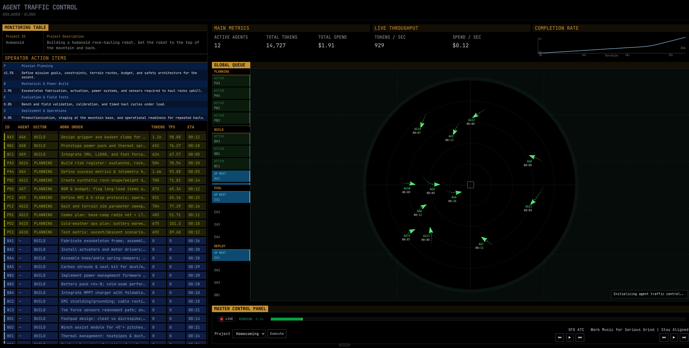

# Agent Traffic Control

A minimal Next.js dashboard to monitor and control AI agent traffic.



## Getting Started

```bash
git clone https://github.com/gkamradt/agenttrafficcontrol && cd agenttrafficcontrol
npm install
cp .env.example .env  # add your keys if needed
npm run dev
# Open http://localhost:3000
```

## How It Works

On first load the client establishes a connection to a dedicated Web Worker engine (`workers/engine.ts`). Runtime knobs live in `lib/config.ts` and the engine loads a plan definition from `plans/` to build the initial project graph.

The UI immediately sends intents to the worker (set seed → set plan → start running) and the engine begins ticking at `ENGINE_TICK_HZ`, emitting a full `snapshot` once and `tick` diffs thereafter.

Worker messages flow through a tiny transport (`lib/simBridge.ts`) that batches events, then into a coalescing adapter (`lib/bridgeToStore.ts`) that applies them to a single Zustand store (`lib/store.ts`).

All React components read from this store; controls like `components/ControlBar.tsx` post intents (change plan, start/pause, reseed) back to the engine. The store is the UI’s source of truth; the engine is the simulation’s source of truth.

Includes live streams for ambiance:

- ATC: https://www.youtube.com/watch?v=mOec9Fu3Jz0
- Music: https://www.youtube.com/watch?v=jfKfPfyJRdk

## Architecture

```
          .env + lib/config.ts        plans/
                   │                    │
                   ▼                    ▼
             Web Worker Engine  <─ loads plan
                 (ticks)
                   │  snapshot/tick
                   ▼
             lib/simBridge.ts   (batch)
                   │
                   ▼
          lib/bridgeToStore.ts  (coalesce)
                   │
                   ▼
              lib/store.ts  (Zustand appStore)
                   │
                   ▼
            React components (read state)
                   ▲
                   │ intents (set_plan, set_seed, set_running)
          components/ControlBar.tsx via lib/simClient.ts
```
